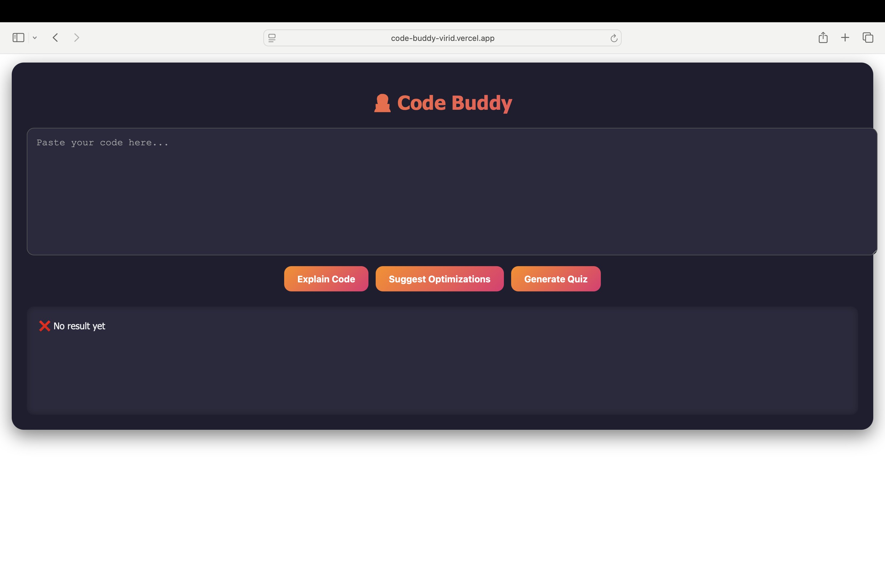
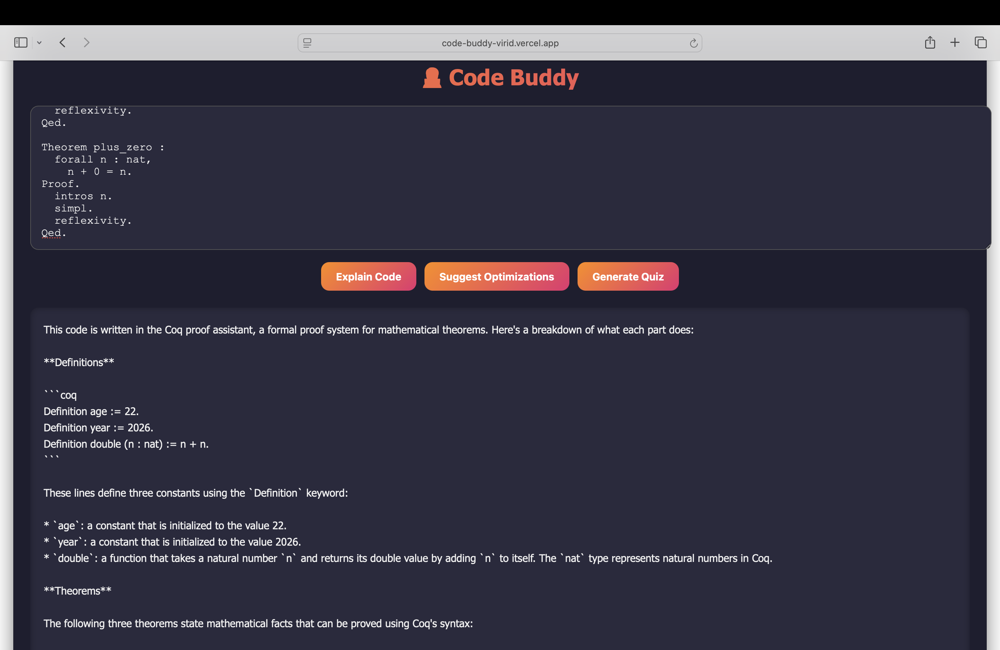
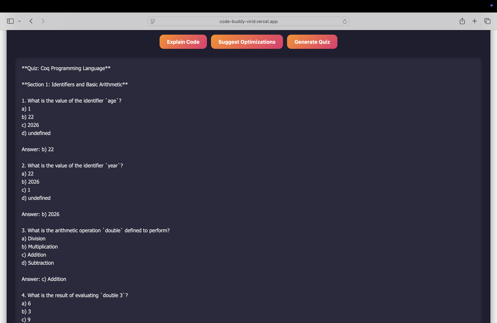

# 🧑‍💻 Code Buddy – AI-Powered Coding Assistant

Code Buddy is an AI-powered coding assistant that helps developers and students understand, analyze, and improve source code using Large Language Models (LLMs). It can explain code, suggest optimizations, and generate quizzes from any code snippet, making it useful for learning, teaching, and software development.

---

## 🚀 Live Demo

**Frontend:** https://code-buddy-virid.vercel.app/

**Backend API:** https://code-buddy-4mtq.onrender.com

**GitHub Repository:** https://github.com/Karthikeya172001/code-buddy

---

## 🎥 Demo Video

**Demo Video:** *(Add your YouTube or Google Drive link here)*

---

## ✨ Features

- 🤖 Explain source code using AI.
- ⚡ Suggest code optimizations and improvements.
- 📝 Generate quizzes from code snippets.
- 📱 Responsive user interface for desktop and mobile devices.
- 🎨 Modern and interactive UI.
- 💡 Helps students, developers, and educators understand code faster.

---

## 🛠 Technologies Used

### Frontend
- React
- JavaScript (JSX)
- CSS

### Backend
- Node.js
- Express.js

### AI
- OpenAI GPT-4.1-mini API

### Deployment
- Vercel (Frontend)
- Render (Backend)

### Other Tools
- Axios
- Git
- GitHub

---

## 🏗 Project Architecture

```
React Frontend
        │
        ▼
Express.js Backend
        │
        ▼
OpenAI GPT-4.1-mini API
        │
        ▼
AI Response
```

---

## ⚙ Installation

### Clone the repository

```bash
git clone https://github.com/Karthikeya172001/code-buddy.git
```

### Move into the project

```bash
cd code-buddy
```

### Install dependencies

```bash
npm install
```

### Create a `.env` file

```env
OPENAI_API_KEY=your_openai_api_key
```

### Start the backend

```bash
npm start
```

### Start the frontend

```bash
npm start
```

---

## 📖 How to Use

1. Open the live application.
2. Paste any source code into the editor.
3. Click one of the following options:
   - Explain Code
   - Suggest Optimizations
   - Generate Quiz
4. View the AI-generated response instantly.

---

## 📂 Project Structure

```
code-buddy/
│
├── client/
│   ├── src/
│   ├── public/
│   └── package.json
│
├── server/
│   ├── routes/
│   ├── controllers/
│   ├── package.json
│   └── .env
│
├── README.md
└── package.json
```

---

## 🎯 Future Improvements

- Support more programming languages.
- AI-powered bug detection.
- Static code analysis.
- Unit test generation.
- Security vulnerability detection.
- GitHub repository analysis.
- Download AI-generated reports.

---

## 📸 Screenshots

### Home Page



### Code Explanation



### Code Optimization


### Quiz Generation



---

## 👨‍💻 Author

**Gorityala Karthikeya**

📧 Email: gorityalakarthikeya@gmail.com

🔗 LinkedIn: https://www.linkedin.com/in/karthikeya-gorityala

💻 GitHub: https://github.com/Karthikeya172001

---

## 📄 License

This project is intended for educational, research, and portfolio purposes.

---

⭐ If you found this project useful, consider giving it a star on GitHub!
